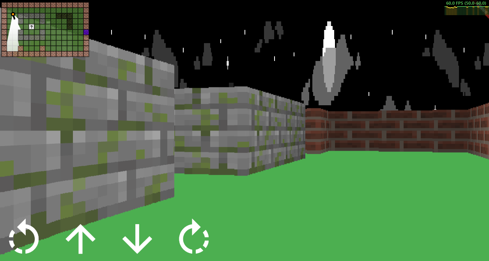

# Raycasting Engine for Flutter

This project is a Raycasting Engine implemented in Flutter. Raycasting is a technique commonly used in 3D graphics to create a 3D-like effect in a 2D environment. The engine utilizes raycasting to simulate a 3D perspective, enabling the creation of a basic 3D environment in a 2D game.

## Tutorial Source

This Raycasting Engine is based on the tutorial provided by [Vinícius Avellar](https://github.com/vinibiavatti1). You can find the original tutorial [here](https://github.com/vinibiavatti1/raycastingtutorial).

## How it Works

The Raycasting Engine simulates a first-person view in a 2D environment. It calculates and draws rays originating from the player's position and shooting out at specific angles to determine what is visible in the scene. The rays interact with the walls in the map, creating the illusion of a 3D view.

### Components

The project consists of the following main components:

1. **calculation_helpers.dart**: Contains various helper functions for calculations, such as converting degrees to radians, getting the distance between two points, and applying shading to wall colors based on their distance from the player.

   - `double degreesToRadians(double degrees)`: Converts degrees to radians.
   - `double cosDegrees(double degrees)`: Calculates the cosine of an angle in degrees.
   - `double sinDegrees(double degrees)`: Calculates the sine of an angle in degrees.
   - `double getDistance(Offset a, Offset b)`: Calculates the Euclidean distance between two points.
   - `Color getShadowedColor(Color color, double distance)`: Applies shading to a wall color based on its distance from the player.
   - `int getMapValue(Offset position, List<List<int>> map)`: Returns the value at a specific position in the map.

2. **drawing_helpers.dart**: Contains functions responsible for drawing the various elements in the game, such as the minimap, rays, player, walls, textures, sky, and ground.

   - `void drawMiniMap(Canvas canvas, ... )`: Draws the minimap with the map layout and textures.
   - `void drawMiniMapRays(Canvas canvas, ... )`: Draws rays on the minimap to represent the player's view.
   - `void drawMiniMapPlayer(Canvas canvas, ... )`: Draws the player's icon on the minimap.
   - `void drawSky(Canvas canvas, ... )`: Draws the sky on the 3D view.
   - `void drawWalls(Canvas canvas, ... )`: Draws the walls on the 3D view.
   - `void drawTexture(Canvas canvas, ... )`: Draws textured walls on the 3D view.
   - `void drawGround(Canvas canvas, ... )`: Draws the ground on the 3D view.
   - `void drawBackground(Canvas canvas, ... )`: Draws the background on the 3D view.

3. **texture_helpers.dart**: Provides a function to load textures for the walls in the map.

   - `Future<Map<String, BitmapTexture>> loadTextures()`: Loads and returns a map of textures from their respective bitmap files.
   - `Future<BitmapTexture> getBitmapTexture(String bitmapAsset)`: Loads a bitmap texture from the given asset path.

4. **map_painter.dart**: Custom painter responsible for drawing the minimap based on the current state of the game.

   - `MapPainter(Offset playerPosition, double playerRotation)`: Constructor that sets the player's position and rotation.
   - `void paint(Canvas canvas, Size size)`: Overrides the paint method to draw the minimap.
   - `bool shouldRepaint(covariant CustomPainter oldDelegate)`: Overrides shouldRepaint to control repainting behavior.

5. **ray_casting_painter.dart**: Custom painter responsible for rendering the 3D view using raycasting.

   - `RayCastingPainter(Offset playerPosition, double playerRotation)`: Constructor that sets the player's position and rotation.
   - `void paint(Canvas canvas, Size size)`: Overrides the paint method to render the 3D view.
   - `bool shouldRepaint(covariant CustomPainter oldDelegate)`: Overrides shouldRepaint to control repainting behavior.

6. **data.dart**: Contains various constants and data structures used in the engine, such as screen dimensions, player information, map data, and texture mapping.

## Acknowledgments

- Special thanks to [Vinícius Avellar](https://github.com/vinibiavatti1) for the original tutorial that inspired this project.

## License

This project is licensed under the [MIT License](LICENSE).

## Contributions

Contributions to this project are welcome. If you find any issues or have suggestions for improvement, feel free to open an issue or create a pull request.

Happy coding!
